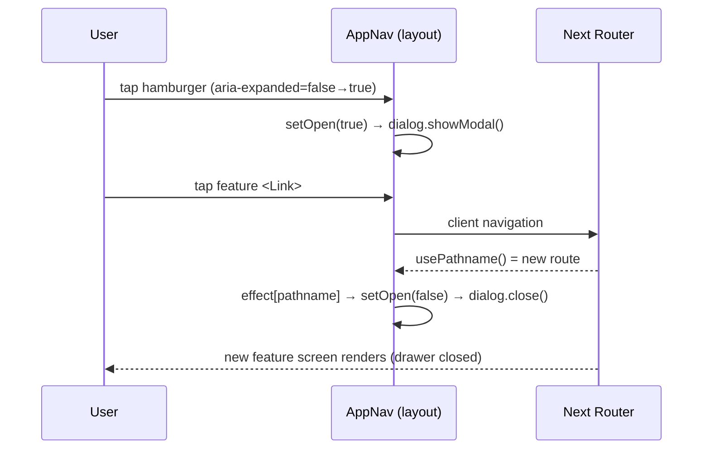

# Design: Mobile-first pass for `wishlist-meme`

## Technical Approach

Two structural pieces plus a codified convention. (1) A self-contained `AppNav` client component mounted once in the root layout provides an app-wide hamburger + slide-in drawer. (2) `BudgetTab` splits into two CSS-toggled renderings (cards at base, table at `sm:`) driven by one shared computed model. (3) Tap-target, grid-breakpoint, and table-reflow rules are frozen in the Convention section below so every slice applies identical values. No JS breakpoint detection and no new test infra are introduced — the drawer reuses the repo's existing native-`<dialog>` pattern; layout switching is pure Tailwind.

## Architecture Decisions

### Decision: Mount drawer in root layout, not PageHeader
**Choice**: New `shared/components/AppNav/` client component rendered in `app/layout.tsx` `<body>` before `{children}`. Its own `fixed top-4 right-4 z-40` trigger.
**Alternatives**: Integrate trigger into `PageHeader` (per proposal's Affected Areas).
**Rationale**: `app/page.tsx` (home) has NO `PageHeader`, but the drawer must be reachable from every screen including home. A layout-level mount guarantees universality with one instance and avoids per-header duplication. Trigger sits top-right to not collide with PageHeader's top-left back-link. Root layout stays a Server Component; only `AppNav` is `"use client"`.

### Decision: Drawer = native `<dialog>` + `showModal()`, same pattern as `ModalShell`
**Choice**: Style a native `<dialog>` as a full-height left slide-in panel. Local `useState` for open; `showModal()`/`close()` in an effect.
**Alternatives**: Custom div + manual focus-trap + Escape handler; reuse `ModalShell` directly; add a headless-ui dependency.
**Rationale**: Native `showModal()` gives focus trap, Escape→`cancel`, and backdrop for FREE with no new dependency — satisfying the minimal-a11y requirement. `ModalShell` isn't reused directly because its `m-auto` centered layout doesn't fit a side panel, but the technique is identical, so tests reuse the established stub.

### Decision: Local state + `usePathname`, no context, no global store
**Choice**: `open` is local `useState` inside `AppNav` (trigger + drawer are one component, so no cross-component sharing). Active link and auto-close both derive from `usePathname()` (`next/navigation`).
**Alternatives**: React Context; a state library.
**Rationale**: Confirmed no global-state library exists. One component owns the state — context would be over-engineering. `usePathname` is the App-Router primitive for the current route (verified in `node_modules/next/dist/docs/.../use-pathname.md`); it updates on client navigation without refetch.

### Decision: Auto-close via effect on pathname change
**Choice**: `useEffect(() => setOpen(false), [pathname])`.
**Rationale**: App Router PRESERVES layout state across navigation, so a layout-mounted drawer will NOT remount/reset on route change. Closing must be explicit, keyed to `pathname`. This is the load-bearing mechanic of the nav flow.

### Decision: BudgetTab dual render, CSS-toggled, one shared model
**Choice**: `BudgetTab` computes the model once, then renders `<BudgetCardsView className="sm:hidden">` and `<BudgetTableView className="hidden sm:block">`. Desktop table markup is the current markup, unchanged.
**Alternatives**: JS `matchMedia`/`useMediaQuery` swap.
**Rationale**: No `matchMedia` mock or `setupFiles` exists; jsdom can't evaluate media queries. CSS-only keeps behavior tests valid and adds zero infra. Both blocks exist in the jsdom DOM, so tests MUST scope via `data-testid="budget-cards"` / `budget-table` + `within` to avoid duplicate matches. Data derivation stays in the parent — the two views differ only in markup, no logic duplication.

## Data Flow — nav (see sequence below)

    Trigger(aria-expanded) ──click──▶ setOpen(true) ──▶ <dialog>.showModal()
      user taps a feature Link ──▶ route change ──▶ usePathname() updates
        └─ effect [pathname] ──▶ setOpen(false) ──▶ dialog.close() ──▶ new page renders



## Responsive Convention (canonical — every slice cites this)

| Concern | Rule |
|---------|------|
| Min tap target | `min-h-11 min-w-11` (44px) + `inline-flex items-center justify-center`; icon buttons add padding to reach it |
| Form-field grid | `grid-cols-2` → `grid-cols-1 sm:grid-cols-2` |
| Card grid | Base `grid-cols-1`, expand at `sm:`/`md:`/`lg:` per existing precedent |
| Table reflow | A table with >2 variable-width/currency columns renders stacked cards at base and the table at `sm:` via two DOM blocks (`sm:hidden` / `hidden sm:block`) |
| Control bars | Add `flex-wrap` to no-wrap `flex` rows (e.g. BudgetTab copy/export bar) |

## File Changes

| File | Action | Description |
|------|--------|-------------|
| `shared/components/AppNav/AppNav.tsx` | Create | Client hamburger + `<dialog>` drawer; local state; `usePathname` active + auto-close |
| `shared/navigation/features.ts` | Create | Single source of feature nav items (route, label, icon); reused by drawer and optionally `app/page.tsx` |
| `app/layout.tsx` | Modify | Render `<AppNav />` in `<body>` before `{children}` |
| `features/finance/.../Budget/BudgetTab.tsx` | Modify | Extract `BudgetCardsView`/`BudgetTableView`; CSS-toggle; wrap control bar; bump `+`/Cerrar buttons to tap-target |
| `.../shopping-list/.../ShoppingItemRow.tsx`, `CategoryTabs.tsx` | Modify | Icon buttons to `min-h-11 min-w-11` |
| 5 modal form files (wishlist, home-improvements ×2, savings ×2) | Modify | `grid-cols-2` → `grid-cols-1 sm:grid-cols-2` |

## Interfaces

```ts
// shared/navigation/features.ts
export interface FeatureNavItem { href: string; label: string; icon: string; }
export const FEATURE_NAV_ITEMS: FeatureNavItem[];
```

## Testing Strategy

| Layer | What | Approach |
|-------|------|----------|
| Unit | AppNav open/close, active link, auto-close on route change | Testing Library + `fireEvent`; stub `HTMLDialogElement.prototype.showModal/close` in `beforeAll` (same as existing modal tests); mock `usePathname` from `next/navigation` |
| Unit | BudgetTab both views render same data | Scope queries with `data-testid` + `within` |
| Manual | Mobile 375–430px device pass | Release gate (no visual-regression tooling) |

**Test infra**: NO `vitest.config.mts` change required. No `matchMedia` mock needed (CSS-only switching). The drawer needs only the `showModal/close` stub already duplicated across 7 modal test files. Optional future DRY: extract that stub into a `setupFiles` entry — deliberately deferred to keep this change's slices small.

## Migration / Rollout

No data/schema migration. UI-only; each slice is an isolated PR. Drawer is additive (revert restores back-link model); BudgetTab keeps its desktop table (revert mobile cards independently).

## Resolved Decisions

- **`FEATURE_NAV_ITEMS` count**: 6 entries (finance, home-improvements, savings, shopping-list, todo, wishlist). `login` is excluded — it's an auth route, not a content feature, and matches the existing home-grid precedent.
- **Trigger visibility on desktop**: hidden via `lg:hidden` on the `AppNav` trigger. Desktop keeps its current appearance unchanged (no new visible element), consistent with this change's mobile-only scope and the "no desktop regression" requirement in `responsive-layout`.
