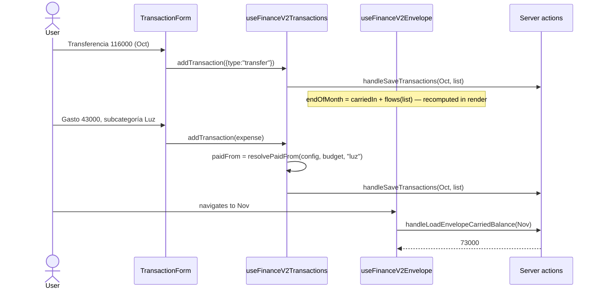

# Design: Envelope account ("Servicios") for finance-v2

## Next 16.2.9 docs (AGENTS.md gate)

No new Next API surface. The two new actions follow the exact auth-gated `"use server"` pattern
already validated against `node_modules/next/dist/docs/01-app/03-api-reference/01-directives/use-server.md`
by `finance-v2-movimientos-month-nav` (read Server Function invoked from a client effect, auth from
cookies, inputs validated in the function). Apply MUST re-check that doc for deprecations before
writing the actions, per AGENTS.md.

## Domain model

```ts
// FinanceV2Transaction.ts
| (TransactionBase & { type: "transfer" })
| (TransactionBase & {
    type: "expense";
    bucket: ExpenseBucketKey;
    category: TransactionCategoryRef | null;
    /** Snapshot at creation. Absent = paid from the main account (also every legacy record). */
    paidFrom?: "envelope";
  })

// EnvelopeConfig.ts (new)
export interface EnvelopeConfig {
  name: string;            // "Servicios"
  boundCategoryId: string; // top-level BudgetCategory id ("Cuentas")
  openingBalance: number;
  openingMonth: string;    // YYYY-MM, set once on creation
}
```

Stored as `EnvelopeConfig | null` under `finance-v2-envelope-config`.

### Decision D1 — stamp `paidFrom` instead of a live lookup

| Option | Pros | Cons |
|---|---|---|
| **Snapshot `paidFrom` at creation** ✅ | Matches the existing snapshot contract (`TransactionCategoryRef`); deleting/moving a subcategory or rebinding never rewrites history; legacy expenses are naturally excluded (the opening balance already reflects them) | Needs one resolver at creation time |
| Live lookup "is category.id under bound category?" | No schema change | Deleting "Luz" would silently move all past bills back to the main balance; rebinding rewrites history; legacy expenses in the opening month would double-count against the opening balance |

The resolver lives in the domain (`resolvePaidFrom(config, budget, categoryId)`) and is called by
the hook's `addTransaction`, not the form — the form never decides funding (user never picks an
account, by design).

### Decision D2 — derive the cumulative balance, never store it

A stored running total must be patched on every add/delete in any month and drifts on any missed
path (fire-and-forget saves already swallow errors). Deriving it is always correct and cheap for a
personal app (~12 month keys per year, one `mget`).

To keep the in-memory viewed month authoritative (it may have unsaved-yet-optimistic mutations),
the server returns only the **carried-in** balance:

```
carriedIn(M) = openingBalance + Σ_{m ∈ [openingMonth, M)} (transfers(m) − envelopePaid(m))
endOfMonth(M) = carriedIn(M) + transfers(viewed list) − envelopePaid(viewed list)
```

`carriedIn(M)` for `M < openingMonth` is `null` (card hidden). For `M === openingMonth` it is
`openingBalance` with no KV read.

### Decision D3 — main totals exclude envelope activity

`computeTransactionTotals` returns `{ income, expense, savings, transfer, balance }` where
`expense` excludes `paidFrom === "envelope"` and `balance = income − expense − savings − transfer`.
Envelope-paid spend is shown on the envelope card ("Pagado este mes"), not in "Gastos", so every
number on the main summary adds up. `spendRollup` / `monthAnalysis` ignore `paidFrom` entirely:
budget tracking is unchanged. `spendLeafRef` gains `case "transfer": return null`.

## Pure functions (domain/envelope.ts)

```ts
export interface EnvelopeFlows { transferred: number; paid: number }
export function computeEnvelopeFlows(list: FinanceV2Transaction[]): EnvelopeFlows;
export function monthsFromTo(from: string, toExclusive: string): string[]; // via nextMonth
export function resolvePaidFrom(
  config: EnvelopeConfig | null, budget: BudgetConfig, categoryId: string | null,
): "envelope" | undefined;
export function suggestedTransfer(
  config: EnvelopeConfig, budget: BudgetConfig, month: string,
): number | null; // toCategoryView(bound, month) → parent.total | leaf.monthlyAmount; null if bound missing
```

## Data + actions

```ts
// kvAdapter.ts
const ENVELOPE_CONFIG_KEY = "finance-v2-envelope-config";
loadEnvelopeConfig(): Promise<EnvelopeConfig | null>      // try/catch → null
saveEnvelopeConfig(config: EnvelopeConfig): Promise<void>  // swallow
loadTransactionsForMonths(months: string[]): Promise<FinanceV2Transaction[]>
  // one redis.mget over transactionsKey(m); same legacy month backfill as loadTransactions; [] on error

// financeV2Actions.ts — same wishlist_auth gate as siblings
handleSaveEnvelopeConfig(config)            // validates openingMonth + finite numbers
handleLoadEnvelopeCarriedBalance(month): Promise<number | null>
  // isTransactionMonth(month) guard; loads config; null if none or month < openingMonth;
  // otherwise openingBalance + flows(loadTransactionsForMonths(monthsFromTo(openingMonth, month)))
```

The balance computation stays server-side so the client never downloads every month's list.

## Presentation

### State ownership

| State | Lives in | Why |
|---|---|---|
| `envelopeConfig` | `useFinanceV2Envelope` (new), called from `FinanceV2Screen` | Survives tab switches (design decision #1 of the screen) |
| `carriedIn` + request token | `useFinanceV2Envelope` | Same ordering guard as `useFinanceV2Transactions` |
| `budget` | existing `useFinanceV2Budget` | Needed for `resolvePaidFrom` + `suggestedTransfer` |

### Flow: payday → bill → next month



### Cross-month saves

`useFinanceV2Transactions` gains an optional `onCrossMonthSaved(month)` param, invoked after
`onSaveToOtherMonth(tx)` resolves. `FinanceV2Screen` wires it to `envelope.refreshCarried()` when
`month < viewedMonth` (a later month cannot affect the carried-in value). A save into a later month
needs no refresh.

### Components

- `Envelope/EnvelopeCard.tsx` — name, "Saldo inicial del mes" (carriedIn), "Transferido",
  "Pagado", "Saldo" (endOfMonth, red + warning text when < 0). Hidden while `isLoadingMonth` or
  when `carriedIn === null`.
- `Envelope/EnvelopeReminder.tsx` — shown when `carriedIn !== null && flows.transferred === 0`.
  "Todavía no transferiste a {name} este mes. Sugerido: {amount}" or, if the bound category is
  missing, "La categoría vinculada ya no existe. Revisá la configuración."
- `Envelope/EnvelopeConfigModal.tsx` — name input, top-level category select, opening balance.
  Reached from the card ("Editar") or, with no config, from a small "Configurar cuenta separada"
  button in `TransactionsTab`.
- `TransactionForm` — `"transfer"` option only when `hasEnvelope`; no extra fields.
- `TransactionRow` — transfer shows "Transferencia → {name}"; envelope-paid expense shows a small
  "desde {name}" hint.
- `MovementSummary` — adds "Transferencias" line; "Gastos" is now main-account-only.

UI copy is Spanish to match the existing screens.

## Edge cases

- Bound category renamed: config stores id → unaffected.
- Bound category deleted: card still works; reminder switches to reconfigure message; new expenses
  can no longer resolve to it, so none are stamped.
- Rebinding to another category: past stamps unchanged; future expenses follow the new binding.
- `openingBalance` edited later: derived balances update everywhere immediately.
- Savings with `sourceCategory` in the bound category: still main-account (non-goal).

## Rollback

See proposal. Add a defensive `default` branch in totals ONLY if rolling back with `transfer` data
present; not part of the forward implementation (exhaustiveness stays compile-checked).

## Testing strategy

| Layer | Tests |
|---|---|
| `envelope.ts` | flows, monthsFromTo (incl. year boundary, empty range), resolvePaidFrom (sub, childless bound, outside, null config, null category), suggestedTransfer (parent, leaf, weekly, missing) |
| `transactionTotals` | transfer total, envelope expense excluded, balance formula, legacy expenses |
| `spendRollup` | transfer contributes nowhere; envelope expense still counts on its leaf |
| `kvAdapter` / actions | config round-trip + defaults; mget backfill; auth gate; month < opening → null; carried math |
| hooks | envelope carried fetch per month + ordering guard; cross-month refresh only for earlier months; stamp applied in addTransaction |
| components | card numbers + negative warning; reminder visibility/suggestion/missing category; form option gating; row labels; summary line |
